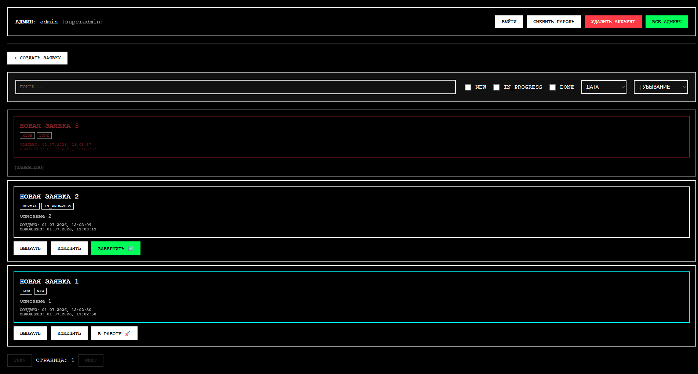
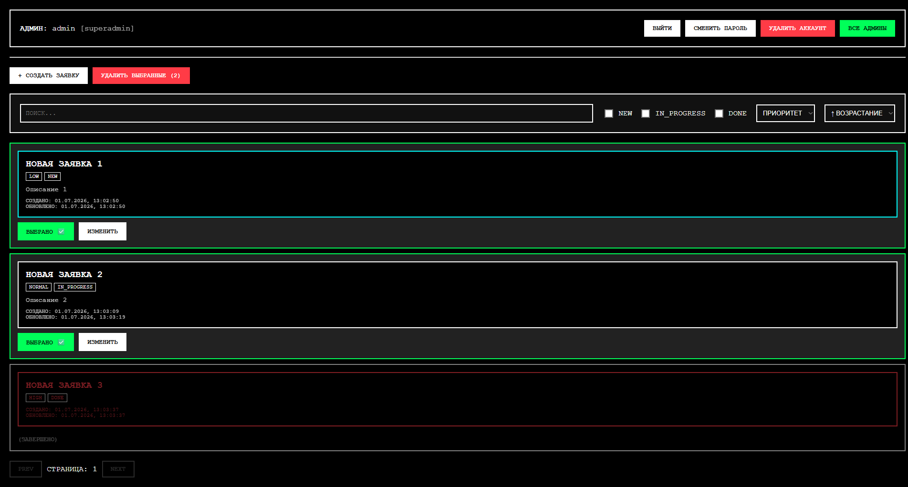
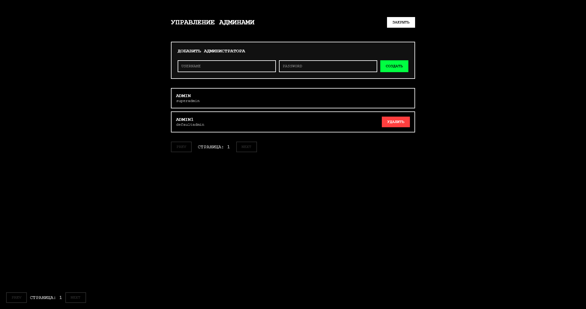

## 🚀 Запуск проекта

## Backend

**Способ 1: Использование `uv`**
```bash
cd backend
uv sync
uv run python -m src.main
```

**Способ 2: Использование `pip`**
```bash
cd backend
python -m venv venv
# Активация:
# Windows: venv\Scripts\activate
# Linux/macOS: source venv/bin/activate

pip install -r requirements.txt
python -m src.main
```
### Сваггер будет по адресу http://127.0.0.1:8000

## Frontend

```bash
cd frontend
npm install
npm run dev
```

## Тестирование бекенда

```bash
pytest -v 
```

**или если через `uv`**

```bash
uv run pytest -v 
```

## Скрины
 
 
 
